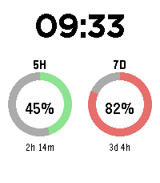

# Claude Usage — Pebble Time 2 watchface



[Usage4Claude](https://github.com/f-is-h/Usage4Claude)（macOSメニューバー常駐アプリ）と同じ発想で、
Claude Code / Claude.ai の **5時間枠** と **7日枠** の使用率を Pebble Time 2（emery）の
ウォッチフェイスに表示する。合わせて、日常使いに欲しかった時刻・日付・電池・Bluetooth・
天気・通勤バスの次発案内も1画面に詰め込んでいる。

Pebbleアプリストアに同等の既存ウォッチフェイスは無し（2026年9月時点で確認）。

ビルド済みの `.pbw` は [Releases](https://github.com/ponderingm/pebble-claude-usage/releases) からダウンロードできる。

## 表示内容

レイアウトは [Pebble Mesh](https://apps.repebble.com/pebble-mesh_20546b1dc76e4eb0aa4cbc1f) を参考に、
縦一列にテキストを積む一覧表スタイルをやめて、上下の使用率バーの内側を **Header / Body / Footer /
Status** の4領域に分けている。配色はダークスレート（黒背景・白文字、使用率バーと天気アイコンの色
だけアクセントとして残す）。

- **使用率バー**（画面最外殻、上下、薄め）: 上＝5時間枠、下＝7日枠。使用率に応じて
  緑（70%未満）→オレンジ（70-90%）→赤（90%以上）に変化する色の帯の上に、%とリセットまでの
  カウントダウンを1行で重ねて表示
- **Header**（天気 | バス、横並び）: 左に天気アイコン+気温、右にバスアイコン+次発までの時間
- **Body**（日付＋時刻、中央）: `MM-DD (Day)` の日付と、24時間表示の時刻を大きく表示
  （`clock_is_24h_style()` の設定に関わらず常に24h表示）
- **Footer**: 今のところ意図的に空欄（`draw_footer_band` は予約枠として何もしない）。
  今後ここに別の情報を足せるように場所だけ確保してある
- **Status**（電池 | Bluetooth、アイコンのみ）: `BatteryStateService` から取得した電池残量を
  電池の形のアイコンで表示（20%以下で赤くなる、パーセント文字は出さない）。`ConnectionService`
  で取得したBluetooth接続状態は**切断時のみ**丸に斜線のアイコンを表示（どちらも通信不要）。
  接続中は電池アイコンを段の中央に寄せる
- **天気・気温**: [Open-Meteo](https://open-meteo.com/)（APIキー不要）から現在地の気温と天気を取得し、
  簡易図形アイコン（晴れ・曇り・雨・雪・霧・雷）で表示
- **通勤バス**: 都営バス**業10系統**（本所四丁目⇔木場四丁目）の次発までの残り分数を表示（60分以上は
  `5h31m` のような時分表記）。スマホGPSの現在地と自宅・職場座標の近さから行き帰りを自動判定する

## 仕組み

Pebble本体はインターネットに直接繋がらないため、実際の通信はPebbleスマホアプリ内の
**PebbleKit JS**（`src/pkjs/index.js`）が担当する:

1. Clay設定画面（`src/pkjs/config.js`）でユーザーが貼り付けた **Claude OAuth リフレッシュトークン**
   を使い、`https://console.anthropic.com/v1/oauth/token` でアクセストークンを取得・キャッシュする。
2. `https://api.anthropic.com/api/oauth/usage` を叩いて `five_hour` / `seven_day` の
   `utilization`（%）と `resets_at`（リセット時刻）を取得する。
3. Clay設定画面で入力した自宅・職場座標が揃っていれば、スマホの位置情報（`src/pkjs/geo.js`）を取得し、
   現在地から自宅・職場どちらに近いかで通勤バスの行き帰り（`src/pkjs/bus.js` /
   `src/pkjs/bus_timetable.json`）を判定する。天気（`src/pkjs/weather.js` /
   `src/pkjs/weather_codes.json`）も同じ現在地から取得する。
4. `Pebble.sendAppMessage` で時計本体（`src/c/main.c`）に使用率・天気・バスの値を送る
   （電池残量・Bluetooth接続状態は時計側で完結するため送信しない）。
5. 時計側は受け取った値を画面に描画する。

更新は起動時・設定変更時・時計のSELECTボタン押下時・定期ポーリング（既定15分、設定で変更可）
で行われる。天気・バスの取得に失敗しても使用率の更新は継続する。

## リフレッシュトークンの入手方法

以下のいずれか:

- `claude setup-token` コマンドを実行して発行する。
- 既にこのマシンで `claude` CLI にログイン済みなら、`~/.claude/.credentials.json` の
  `claudeAiOauth.refreshToken` の値をそのまま貼り付けても良い。

**トークンは第三者と共有しないこと。このリポジトリにコミットしないこと。**
`src/pkjs/config.js` の入力欄を通じてスマホ内の `localStorage` にのみ保存される。

## ビルド・インストール

```sh
pebble build
pebble install --emulator emery      # QEMUエミュレータで見た目を確認
pebble install --phone <ip>          # 実機Pebble Time 2 へインストール（要ペアリング済みスマホアプリ）
```

エミュレータでは `pebble sdk install-emulator emery` が未実行の場合は先に実行しておくこと。
設定画面（Clay）はエミュレータの場合ブラウザが自動で開く。実機の場合はPebbleスマホアプリの
アプリ設定から開く。

`pebble logs` でPebbleKit JS側のトークン更新・使用量取得・AppMessage送信ログを確認できる。

## プロジェクト構成

```
src/c/main.c                  ウォッチフェイス本体（時刻/日付/電池/BT/使用率枠/天気/バス）
src/pkjs/index.js             PebbleKit JS（OAuth更新・使用量取得・天気/バス統合・送信）
src/pkjs/config.js            Clay設定画面定義（トークン・更新間隔・自宅職場座標・天気/バスON/OFF）
src/pkjs/geo.js                位置情報取得・2点間距離・行き帰り方向判定
src/pkjs/weather.js            Open-Meteo呼び出し・天気コード変換
src/pkjs/weather_codes.json    WMO天気コード→アイコン形状の対応表（外部データ）
src/pkjs/bus.js                 曜日別ダイヤ選択・次発残り分数の計算
src/pkjs/bus_timetable.json    都営バス業10系統の時刻表（外部データ、平日ダイヤのみ収録）
package.json                    プロジェクトマニフェスト（UUID・messageKeys等）
```

## 対応機種

`emery`（Pebble Time 2, 200x228, 64色）のみを対象にビルドする。他機種は未検証。

## TODO（デザイン検討）

現状はプロトタイプ段階。以下は今後デザインを詰める項目:

- [ ] 使用率バー・電池・BT・天気・バスの配色/フォントサイズを実機カラーe-paperで確認する（閾値は `main.c` 冒頭の `THRESHOLD_WARN_PCT` / `THRESHOLD_DANGER_PCT`、レイアウト定数も同ファイル冒頭）
- [ ] アプリアイコンをデザインする（現状未作成、Pebbleアプリ一覧でデフォルトアイコンのまま）
- [ ] Clay設定画面のUI・文言（自宅/職場座標入力含む）を実機ブラウザで確認する（ヘッドレス開発機では未検証）
- [ ] Opus/Sonnet週次枠など、表示指標を増やすかどうかの検討（現状は5時間枠・7日枠の2つのみ）
- [ ] `src/pkjs/bus_timetable.json` の土曜(`saturday`)・日祝(`sunday_holiday`)ダイヤが未収録（現状 `null` で「バスなし」扱い）。tobus.jp等で実データを取得して追記する
- [ ] 通勤バスの行き帰り判定（`src/pkjs/geo.js` の `AMBIGUOUS_DISTANCE_MARGIN_M` / 時刻フォールバック境界）が実際のGPS挙動に合っているか実機で確認する
- [ ] 天気アイコンは図形描画のみ（ビットマップ資源なし）。見た目の調整や資源化するかどうかの検討
- [ ] gabbro（Pebble Round 2）等、他機種への対応要否

## 使用したツール・スキル

このプロトタイプは Claude Code を使って、以下を組み合わせて作成した:

- [Usage4Claude](https://github.com/f-is-h/Usage4Claude) のソースコード（`Services/ClaudeOAuth*.swift` 等）を読み、
  Anthropic の非公開OAuth使用量API（トークンリフレッシュ・使用量取得のURL/ヘッダー/レスポンス形式）を特定した。
- [coredevices/pebble-watchface-agent-skill](https://github.com/coredevices/pebble-watchface-agent-skill)
  （Core Devices公式のPebbleウォッチフェイス生成用Claude Codeスキル）を参照し、特に
  `tutorials/c-watchface-tutorial/part4`（AppMessage + PebbleKit JSで外部APIを叩くパターン）と
  `part6`（Clay設定画面のパターン）をベースに `src/c/main.c` / `src/pkjs/index.js` / `src/pkjs/config.js` を実装した。
  同スキルの説明から `emery` = Pebble Time 2（200x228, 64色）であることも確認した。
- Pebble Appstore ([apps.repebble.com](https://apps.repebble.com/)) を調査し、同等の既存ウォッチフェイスが
  無いことを確認した上で開発した。
- 実装確定前に、実際のOAuthリフレッシュトークンで使用量APIを一度叩き、レスポンスの実フィールド
  （`utilization` / `resets_at` 等）を確認してから `pkjs/index.js` の仕様を決めた。

## ドキュメント

- [Pebble SDK Documentation](https://developer.repebble.com/)
- [Usage4Claude](https://github.com/f-is-h/Usage4Claude)（このウォッチフェイスの着想元）
